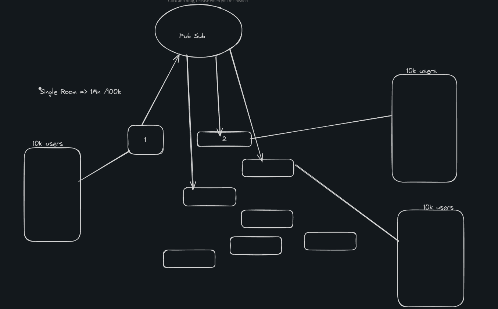

# Chess App

- This is a chess application built using React and Node.js. It allows two players to join a game and play against each other. The backend uses a WebSocket server for real-time communication between the players. The chess logic is handled by the chess.js library.

## Features

- WebSocket server for real-time communication
- Move validation for chess moves
- Integration with chess.js library

## Progress

- Currently the game is playable with two players
- Plan to make it Resileint
  
- Join an arena option to be added (Pub/Sub)
  

  ## Installation

  1. Clone the repository:

  ```bash
  git clone https://github.com/AkhilJ321/chess.git
  ```

  2. Install the dependencies :

  ```bash
  npm install
  ```

  3. Start the server:

  ```bash
  npm run dev
  ```
